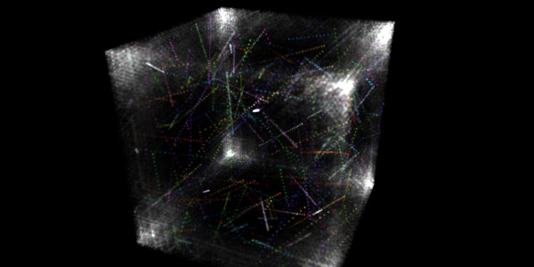
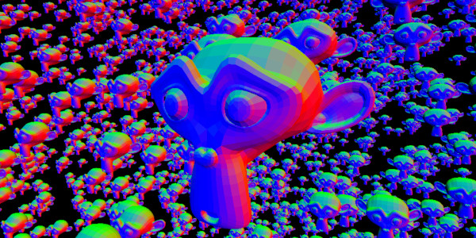
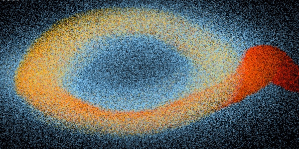

# MonoGame Shader Samples Overview

Each sample is in a separate branch of this repository, so don't use this branch here, pick a sample from below first. 
The samples are based on a [custom MonoGame fork](https://github.com/cpt-max/MonoGame), that adds tesselation, geometry and compute shaders. 
You don't need to build the fork in order to run the samples, as they use prebuilt NuGet packages. As long as .Net 6 is installed, they should just launch. 

[Equivalent Android Samples](https://github.com/cpt-max/MonoGame-Shader-Samples-Mobile) 
[Compute Shader Guide for MonoGame](https://github.com/cpt-max/Docs/blob/master/MonoGame%20Compute%20Shader%20Guide.md) 
[NuGet Packages, Platform Support and Build Requirements](https://github.com/cpt-max/Docs/blob/master/Build%20Requirements.md) 
[Pull Request for main MonoGame Repo](https://github.com/MonoGame/MonoGame/pull/7533) 
[MonoGame Forum Post](https://community.monogame.net/t/compute-tessellation-geometry-shader/16676) 
[Download Prebuilt Executables](https://www.dropbox.com/s/v4gg77pzbniykha/Monogame.Shader.Samples.zip?dl=1) (win-x64, linux-x64, requires .Net 5+)
  

## [Simple Tessellation & Geometry Shader](https://github.com/cpt-max/MonoGame-Shader-Samples/tree/tesselation_geometry)

This sample uses a very simple hull and domain shader to tessellate a single input triangle into many sub triangles. Each sub triangle is then passed into a geometry shader to generate even more triangles along it's edges, which creates a wireframe-like effect.
  

## [Edge-rounding Tessellation Shader](https://github.com/cpt-max/MonoGame-Shader-Samples/tree/edgerounding)

This sample uses a hull and domain shader to round off the edges of a mesh. The mesh is created out of quad patches. The rounding radius and tesselltation factor can be changed dynamically.
  

## [Particle Compute Shader](https://github.com/cpt-max/MonoGame-Shader-Samples/tree/compute_gpu_particles)

This sample uses a compute shader to update particles on the GPU. The particle buffer is used directly by the vertex shader that draws the particles. Since no data needs to be downloaded to the CPU, this method is very fast.
  

## [Collision Test Compute Shader](https://github.com/cpt-max/MonoGame-Shader-Samples/tree/compute_cpu)

This sample uses a compute shader to do brute-force collision checks between circles. The buffer containing the collision results is then downloaded to the CPU, in order to color the circles according to how many collisions they are involved in.
  

## [Pixel-Sort Compute Shader](https://github.com/cpt-max/MonoGame-Shader-Samples/tree/compute_write_to_texture)

This sample uses a compute shader to sort pixels in a texture horizontally by hue.
For each pair of pixels a compute thread is launched, that swaps the pixels (if neccessary) like a bubble sort.
  

## [Edit Mesh Compute Shader](https://github.com/cpt-max/MonoGame-Shader-Samples/tree/compute_write_to_vertex_buffer)

This sample uses a compute shader to modify a vertex and an index buffer directly on the GPU.
  

## [Texture3D Compute Shader](https://github.com/cpt-max/MonoGame-Shader-Samples/tree/compute_write_to_3d_texture)

This sample uses a compute shader to update a 3D texture on the GPU. 
The texture is initialized with a bunch of randomly colored pixels. The pixel's color represents a velocity, so pixels move through the volume.
  

## [Object Culling with Indirect Draw](https://github.com/cpt-max/MonoGame-Shader-Samples/tree/object_culling_indirect_draw)

This sample uses a compute shader to determine the visibility of objects directly on the GPU.
A structured buffer is filled up with all the visible objects, which are then draw using indirect draw. This has the advantage that no data has to be downloaded from the GPU to the CPU. 
There is a [converted version of this sample using an append buffer](https://github.com/cpt-max/MonoGame-Shader-Samples/tree/object_culling_indirect_draw_append), which slightly simplifies the code.
  

## [Particles with Indirect Draw](https://github.com/cpt-max/MonoGame-Shader-Samples/tree/indirect_draw_instances)

This sample uses a compute shader to spawn, destroy and update particles. 
Since the spawn and destroy logic is done on the GPU, the CPU doesn't know how many particles to draw. 
Using indirect draw makes it possible to draw and update the correct number of particles, without the need to download that data to the CPU.
  

