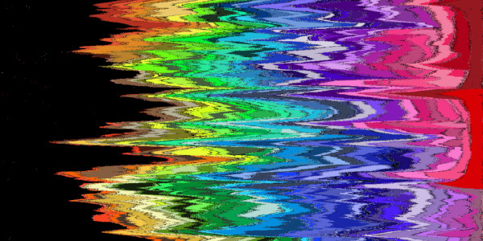

# MonoGame Shader Samples Overview

Each sample is in a separate branch of this repository. 
The samples are based on a [custom MonoGame fork](https://github.com/MonoGame/MonoGame/pull/7533), that adds tesselation, geometry and compute shaders. 
Lazy people can [download the prebuilt executables for Windows](https://www.dropbox.com/s/c5h81mtgw5pnctu/Monogame%20Shader%20Samples.zip?dl=1).

[Compute Shader Guide for MonoGame](https://github.com/cpt-max/Docs/blob/master/MonoGame%20Compute%20Shader%20Guide.md)
  

## [Simple Tessellation & Geometry Shader](https://github.com/cpt-max/MonoGame-Shader-Samples/tree/tesselation_geometry)

This sample uses a very simple hull and domain shader to tessellate a single input triangle into many sub triangles. Each sub triangle is then passed into a geometry shader to generate even more triangles along it's edges, which creates a wireframe-like effect.
  

## [Edge-rounding Tessellation Shader](https://github.com/cpt-max/MonoGame-Shader-Samples/tree/edgerounding)

This sample uses a hull and domain shader to round off the edges of a mesh. The mesh is created out of quad patches. The rounding radius and tesselltation factor can be changed dynamically.
  

## [Particle Compute Shader](https://github.com/cpt-max/MonoGame-Shader-Samples/tree/compute_gpu_particles)

This sample uses a compute shader to update particles on the GPU. The particle buffer is used directly by the vertex shader that draws the particles. Since no data needs to be downloaded to the CPU, this method is very fast.
  

## [Particle Compute & Geometry Shader](https://github.com/cpt-max/MonoGame-Shader-Samples/tree/compute_gpu_particles_geometry)

This is the same compute shader as above, the drawing of the particles is different however. The above sample feeds a vertex buffer, filled with quads, to the vertex shader. This sample feeds point primitives to the vertex shader, and generates the final quads in a geometry shader.   
  

## [Collision Test Compute Shader](https://github.com/cpt-max/MonoGame-Shader-Samples/tree/compute_cpu)

This sample uses a compute shader to do brute-force collision checks between circles. The buffer containing the collision results is then downloaded to the CPU, in order to color the circles according to how many collisions they are involved in.
  

## [Pixel-Sort Compute Shader](https://github.com/cpt-max/MonoGame-Shader-Samples/tree/compute_write_to_texture)

This sample uses a compute shader to sort pixels in a texture horizontally by hue.
For each pair of pixels a compute thread is launched, that swaps the pixels (if neccessary) like a bubble sort.
  

